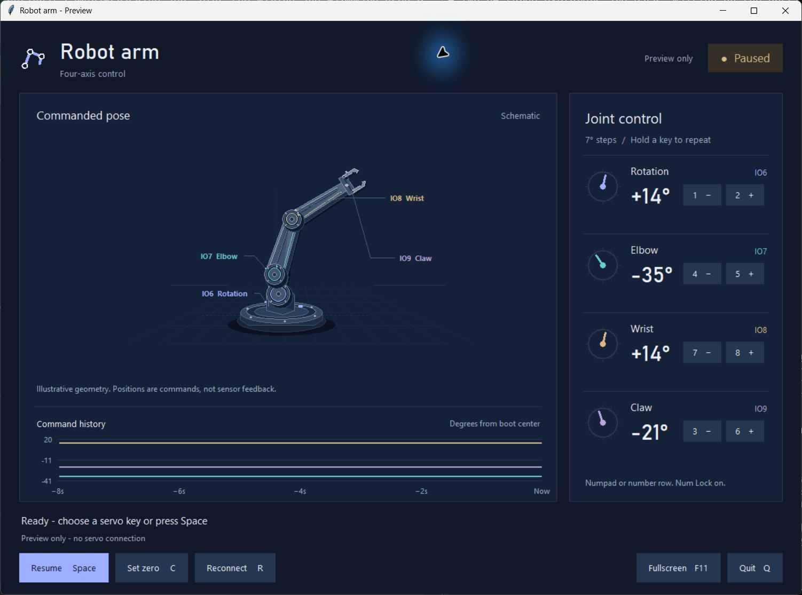

# Your keyboard. Four servos. One control desk.

Drive the arm from a dedicated desktop console: tap a key, watch the joint dial turn, and see the command appear on the history graph. No camera, hand tracking, or pose calibration is needed.

[Back to the README](../README.md) | [Shared wiring and firmware guide](setup.md#4-wire-the-servos)



*The console shows commanded positions. Its arm illustration is a visual guide, not a measured pose or a mechanical simulation.*

## Already set up? Double-click and go

Close the original controller, then double-click **[Start Robot Arm Keyboard.cmd](../Start%20Robot%20Arm%20Keyboard.cmd)**. It connects to **COM70** and opens paused. Click the console to give it keyboard focus, then use the joint keys below.

To use a different port, edit `ROBOT_ARM_PORT=COM70` in that file, or launch it from PowerShell with a port argument:

```powershell
& '.\Start Robot Arm Keyboard.cmd' COM9
```

The camera controller remains available through its original launcher. Run one controller at a time so they do not compete for the USB port.

## First time? Start with a practice run

Install Git and **Python 3.12 for Windows**, including the Python launcher and Tcl/Tk support from the standard installer. Open PowerShell and run:

```powershell
git clone https://github.com/HaiderAli3D/robot-arm-small.git
cd robot-arm-small
powershell -NoProfile -ExecutionPolicy Bypass -File .\scripts\setup-keyboard.ps1
powershell -NoProfile -ExecutionPolicy Bypass -File .\scripts\run-keyboard.ps1
```

Already downloaded the project? Open PowerShell in its folder and run the last two commands.

Setup creates or reuses `.venv`, installs **pyserial 3.5**, and checks Python's Tkinter window support. It does not download MediaPipe, OpenCV, or tracking models. Those packages can remain installed if you also use the camera version; the keyboard console does not load them.

**Launching without a port opens preview mode.** The controls, illustration, and history work, but the app opens no serial connection and sends no commands to hardware.

### A one-minute console tour

Try this in preview mode first:

1. Press **F11** to fill the screen.
2. Tap **2**, **5**, and **8** to move the first three joints. Watch their matching colors across the diagram, dials, and graph.
3. Tap **3** and **6** to explore the claw. Hold a joint key briefly to see repeated movement.
4. Press **Space** to pause. The state indicator makes the change clear.
5. Press **C**, wait four seconds, and watch the position readouts become zero while the pictured arm stays put.
6. Press **F11** again to return to a window.

A joint key automatically resumes control, even when paused. This also applies to the on-screen joint buttons.

## Connect the real arm

Use the existing [servo wiring instructions](setup.md#4-wire-the-servos) and [firmware upload steps](setup.md#5-upload-the-tracking-firmware). The shared sketch is named `ESP32C5_Tracking`; it supports both controller versions. If your board already has the current protocol 2 firmware, switching apps does not require another upload.

Connect the board's USB UART port, close any other controller or Arduino Serial Monitor, and list the available ports:

```powershell
powershell -NoProfile -ExecutionPolicy Bypass -File .\scripts\run-keyboard.ps1 -ListPorts
```

Then start live control with your board's port:

```powershell
powershell -NoProfile -ExecutionPolicy Bypass -File .\scripts\run-keyboard.ps1 -Port COM9
```

Replace `COM9` with the port reported for your board. **A port enables real motor commands.** The console starts paused; a joint key resumes it and moves that joint. Once this works, update the double-click launcher's port for future sessions.

## Know your control desk

| Area | What it tells you |
|---|---|
| State and connection | Whether control is running or paused, and whether you are in preview or connected to the board. |
| Arm diagram | An articulated view of the commanded pose, with a short base link and a longer tool link. |
| Colored joint dials | A quick visual reference for each servo channel. |
| Position readouts | Each joint's command relative to your saved zero. |
| Command history | The last eight seconds on one shared angle scale, measured from the boot center. |

Zeroing changes the position readouts' reference. It does not jump the diagram or history, which remain anchored to the same underlying commands.

The IO7 illustration follows the mounting direction at half scale around raw 90 degrees: a 7-degree command moves the drawing by 3.5 degrees in the reversed visual direction. This is a drawing adjustment; the servo still receives the full command. The display cannot confirm the arm's physical position because these servos provide no position feedback.

The layout adapts to smaller windows, with scrolling when needed. Use **F11** for fullscreen, **Tab** to move between buttons, and **Enter** to activate the focused button. Clicking a joint button makes one step; hold a physical key for repeated steps.

## Keep these keys handy

Use the numpad with **Num Lock on**, or the number row. Keep the console window focused.

| Servo | Decrease | Increase |
|---|---|---|
| IO6 | **1** | **2** |
| IO7 | **4** | **5** |
| IO8 | **7** | **8** |
| IO9 / claw | **3** | **6** |

Each press changes the target by **7 degrees**. Holding a key repeats at **1.5 times the Windows keyboard repeat rate**, starting after one repeat interval instead of the usual typing delay. Keyboard commands apply immediately, without the tracking version's smoothing. Tracking gains in `config.toml` do not change these keyboard steps.

| Key | Action |
|---|---|
| **Space** | Resume or pause. |
| **C** | Save the current commanded positions as zero after four seconds. |
| **R** | Reconnect, keeping your running/paused choice. |
| **F11** | Toggle fullscreen. |
| **Q** or **Esc** | Quit. Esc also quits while fullscreen. |

A joint key or joint-button click resumes control. During the zeroing countdown, either also cancels zeroing and moves that joint.

## Make the current pose your zero

Position the arm with the joint keys, press **C**, and wait four seconds. The servos stay powered and hold their current commanded positions throughout. When the countdown finishes, those positions become **0 degrees** in the readouts. Nothing snaps back, and your running/paused choice is preserved.

The reference lasts for this app session. Restarting clears it. Use the keys to reposition the arm: moving it by hand does not tell the software where the shafts went.

Pausing holds position; it does not cut servo power. The app allows negative angles and commands beyond plus or minus 90 degrees without adding joint limits or automatic pauses. Actual servo travel and the firmware's electrical range still apply. The board centers the servos on boot. Use the external servo supply and common ground described in the wiring guide.

## If something gets in the way

| What you see | What to try |
|---|---|
| The picture moves but the arm does not | Check whether you launched preview mode. Close it and run with `-Port` and your board's port. |
| Port busy or connection failed | Close the other controller and Arduino Serial Monitor. Check the USB cable and port, then press **R**. |
| Number keys do nothing | Click the console, enable Num Lock, or try the number row. |
| The launcher uses the wrong port | Edit `ROBOT_ARM_PORT=COM70`, or pass the correct port as its first argument. |
| Missing Python or serial dependency | Run `scripts\setup-keyboard.ps1` again from the project folder. |
| Tkinter is unavailable | Modify the Python installation to include Tcl/Tk support, then rerun setup. |
| The diagram differs from the real arm | It displays commands rather than measured feedback. Check assembly, boot center, and the IO7 visual scaling described above. |

For direct terminal use, run `python -m arm_control.keyboard_only` inside the project's virtual environment. Options include `--dry-run`, `--port COM9`, and `--list-ports`. The [technical reference](reference.md) covers the shared firmware and serial protocol.
